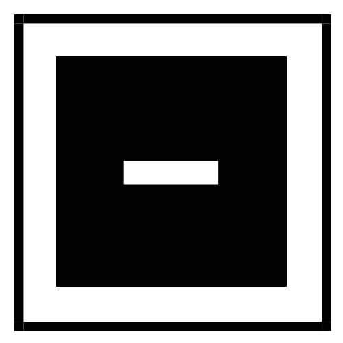
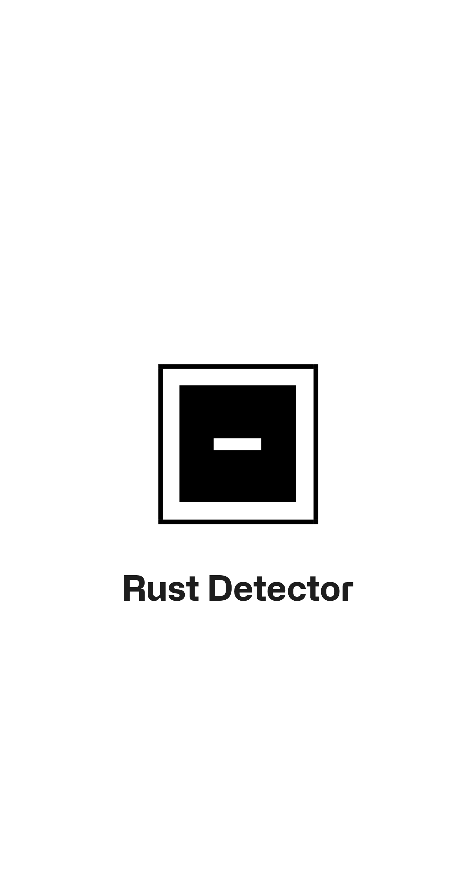
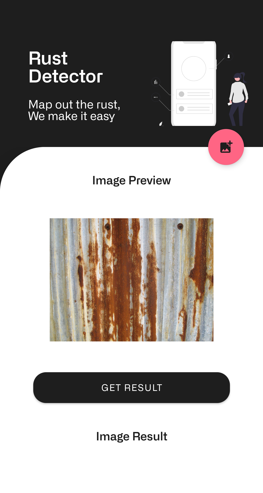
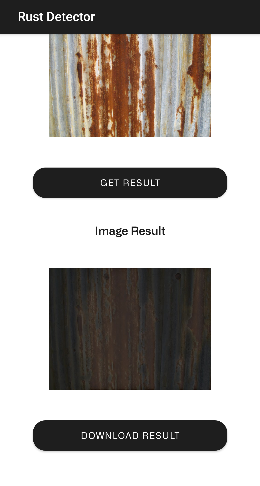

<!--
*** Thanks for checking out the Best-README-Template. If you have a suggestion
*** that would make this better, please fork the repo and create a pull request
*** or simply open an issue with the tag "enhancement".
*** Thanks again! Now go create something AMAZING! :D
-->

<!-- PROJECT SHIELDS -->
<!--
*** I'm using markdown "reference style" links for readability.
*** Reference links are enclosed in brackets [ ] instead of parentheses ( ).
*** See the bottom of this document for the declaration of the reference variables
*** for contributors-url, forks-url, etc. This is an optional, concise syntax you may use.
*** https://www.markdownguide.org/basic-syntax/#reference-style-links
-->

<!-- PROJECT LOGO -->
 

  

  <h3 align="center">Rust Detector</h3>

  

    Making rust detection easy since 2021! [ Bangkit Capstone Project ]
     
    <a href="https://github.com/windaangellina/RustDetector"><strong>Explore the docs »</strong></a>
     
     
    <a href="https://youtu.be/ERyjl43uAzk">View Demo</a>
    ·
    <a href="https://github.com/windaangellina/RustDetector/issues">Report Bug</a>
    ·
    <a href="https://github.com/windaangellina/RustDetector/issues">Request Feature</a>
  

<!-- TABLE OF CONTENTS -->

  
Table of Contents

  <ol>
    <li>
      <a href="#about-the-project">About The Project</a>
      <ul>
        <li><a href="#built-with">Built With</a></li>
      </ul>
    </li>
    <li>
      <a href="#getting-started">Getting Started</a>
      <ul>
        <li><a href="#prerequisites">Prerequisites</a></li>
        <li><a href="#installation">Installation</a></li>
      </ul>
    </li>
    <li><a href="#usage">Usage</a></li>
    <li><a href="#roadmap">Roadmap</a></li>
    <li><a href="#contributing">Contributing</a></li>
<!--     <li><a href="#license">License</a></li> -->
    <li><a href="#contact">Contact</a></li>
    <li><a href="#acknowledgements">Acknowledgements</a></li>
  </ol>

<!-- ABOUT THE PROJECT -->
## About The Project

<table>
    <tr>
        <td><strong>     Splash Screen          </strong></td>
        <td><strong>  Top Layout     </strong></td>
      <td> <strong>      Bottom Layout</strong> </td>
    </tr>
    <tr>
        <td>
          &nbsp;&nbsp;&nbsp;&nbsp;&nbsp;&nbsp;&nbsp;&nbsp;
          
          &nbsp;&nbsp;&nbsp;&nbsp;&nbsp;&nbsp;&nbsp;&nbsp;
        </td>
        <td>
          &nbsp;&nbsp;&nbsp;&nbsp;&nbsp;&nbsp;&nbsp;&nbsp;
          
          &nbsp;&nbsp;&nbsp;&nbsp;&nbsp;&nbsp;&nbsp;&nbsp;
      </td>
      <td>
        &nbsp;&nbsp;&nbsp;&nbsp;&nbsp;&nbsp;&nbsp;&nbsp;
        
        &nbsp;&nbsp;&nbsp;&nbsp;&nbsp;&nbsp;&nbsp;&nbsp;
      </td>
    </tr>
</table>
    
Corrosion is one of the most common causes of structural failure. Based on research and statistical data, 42% of structural failures were due to corrosion in all forms (general corrosion, pitting corrosion, corrosion in the gaps, stress corrosion cracking, corrosion fatigue, and so on) therefore knowing corrosion as early as possible is the best preventive measure to prevent structural failure.

The conventional method to check for corrosion is by bare and unaided eyes which unfortunately is a time-consuming and ineffective process. This is especially true when the situation requires us to check locations that are difficult to reach such as holes and tanks in ships or a high bridge. The cost for hiring manpowers to do this makes this method all the more painful to do. The alternative is by using vendor service which is considerably expensive, averaging on $400 per basic test.

This is our background of why we want to create a corrosion detection system. Our big dream is to apply this model to the drone so corrosion detection in difficult areas is much easier but for now, we will apply it to the android app first.

### Built With

* [Android Studio](https://developer.android.com)
* [Firebase](https://firebase.google.com)
* [Google Cloud Platform](https://cloud.google.com)
* [Kotlin Programming Language](https://kotlinlang.org)
* [Python Programming Language](https://www.python.org/)
* [Flask Framework](https://flask.palletsprojects.com/)
* [Nginx](https://www.nginx.com/)

### Prerequisites

1. Android 5.0 Lollipop (minimum API level 21)
2. Internet Connection

### Installation

1. Download the APK [here](http://bit.ly/RustDetectorAPK)
2. Install the APK to your device

<!-- USAGE EXAMPLES -->
## Usage

How To Use This App
1. Open the apps
2. Upload photos
3. Wait the apps detect the rust
4. Download the result if you want

You can follow this [demo](https://youtu.be/ERyjl43uAzk)

<!-- CONTRIBUTING -->
## Contributing

In general, we follow the "fork-and-pull" Git workflow.

1. Fork the repo on GitHub
2. Clone the project to your own machine
3. Commit changes to your own branch
4. Push your work back up to your fork
5. Submit a Pull request so that we can review your changes

NOTE: Be sure to merge the latest from "upstream" before making a pull request!

<!-- LICENSE -->
<!-- ## License

Distributed under the MIT License. See `LICENSE` for more information. -->

<!-- CONTACT -->
## Contact

Aubert Oktaviantono - [LinkedIn](https://www.linkedin.com/in/auboktav/)   
Hendra Lingga Wijaya - [LinkedIn](https://www.linkedin.com/in/hendra-lingga-wijaya-955b80207/)   
Leny Arinda - [LinkedIn](https://www.linkedin.com/in/lenyarinda/)   
M Rifqi Azkiya J - [LinkedIn](https://www.linkedin.com/in/mrazkiya/)   
Rudi Haryanto - [LinkedIn](http://www.linkedin.com/in/rudiharyanto/)  
Winda Angelina Utama - [LinkedIn](https://www.linkedin.com/in/winda-angelina-utama/)   

Project Link: [https://github.com/windaangellina/RustDetector](https://github.com/windaangellina/RustDetector)

<!-- ACKNOWLEDGEMENTS -->
## Acknowledgements
* [Undraw Free Vectors](https://undraw.co/illustrations)

<!-- MARKDOWN LINKS & IMAGES -->
<!-- https://www.markdownguide.org/basic-syntax/#reference-style-links -->
[contributors-shield]: https://img.shields.io/github/contributors/othneildrew/Best-README-Template.svg?style=for-the-badge
[contributors-url]: https://github.com/othneildrew/Best-README-Template/graphs/contributors
[forks-shield]: https://img.shields.io/github/forks/othneildrew/Best-README-Template.svg?style=for-the-badge
[forks-url]: https://github.com/othneildrew/Best-README-Template/network/members
[stars-shield]: https://img.shields.io/github/stars/othneildrew/Best-README-Template.svg?style=for-the-badge
[stars-url]: https://github.com/othneildrew/Best-README-Template/stargazers
[issues-shield]: https://img.shields.io/github/issues/othneildrew/Best-README-Template.svg?style=for-the-badge
[issues-url]: https://github.com/othneildrew/Best-README-Template/issues
[license-shield]: https://img.shields.io/github/license/othneildrew/Best-README-Template.svg?style=for-the-badge
[license-url]: https://github.com/othneildrew/Best-README-Template/blob/master/LICENSE.txt
[linkedin-shield]: https://img.shields.io/badge/-LinkedIn-black.svg?style=for-the-badge&logo=linkedin&colorB=555
[linkedin-url]: https://linkedin.com/in/othneildrew
[product-screenshot]: images/screenshot.png
