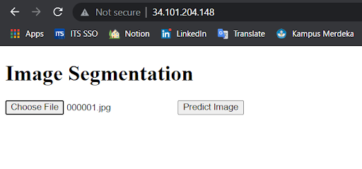
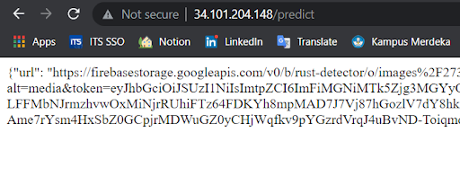

# ML Deployment

Deployment process using Flask web application with Nginx for receive image from Android application. 
Then model will predict and send the output image to Firestore and return the public URL of the image in JSON format so the Android application can access the image.

